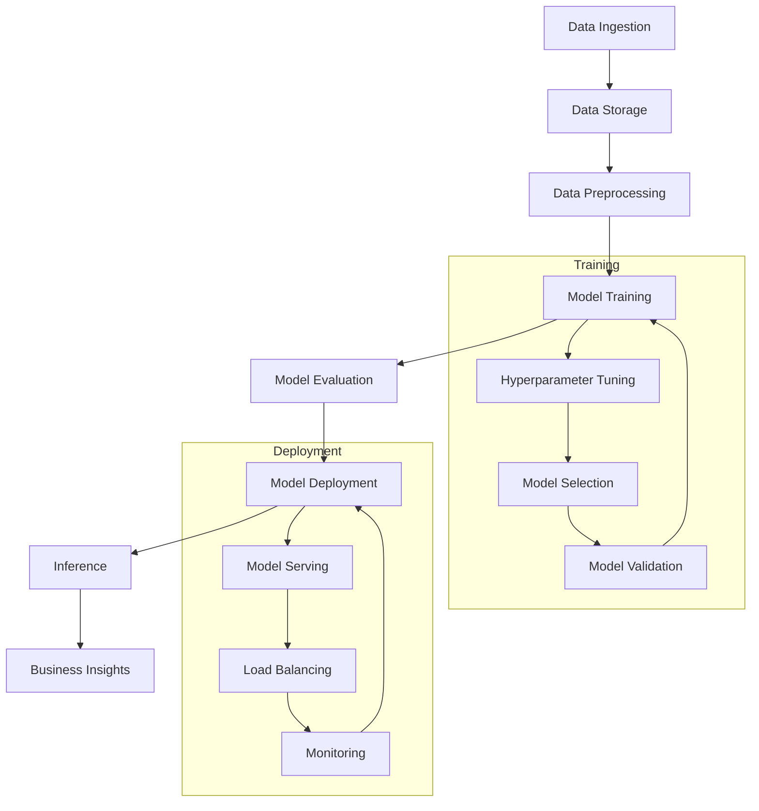

```mermaid
graph TD;
  A[Data Ingestion] --> B[Data Storage];
  B --> C[Data Preprocessing];
  C --> D[Model Training];
  D --> E[Model Evaluation];
  E --> F[Model Deployment];
  F --> G[Inference];
  G --> H[Business Insights];

  subgraph Training
    D --> X[Hyperparameter Tuning];
    X --> Y[Model Selection];
    Y --> Z[Model Validation];
    Z --> D;
  end
  subgraph Deployment
    F --> W[Model Serving];
    W --> V[Load Balancing];
    V --> U[Monitoring];
    U --> F;
  end
```